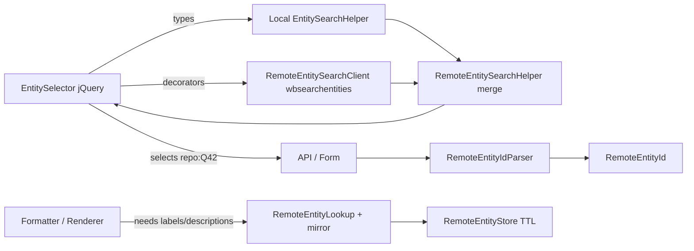

# 33) Federated Values — MVP {#adr_0033}

Date: 2025-07-15

## Status

Draft

## Context

As part of the ongoing federation work in Wikibase, the product and engineering teams decided that the next feature to reach a full minimum viable product would be Federated Values.

Federated Values allow a Wikibase installation to select an Item from a remote repository—in this MVP, from Wikidata—as the value of a statement whose property expects an Item type. When a user enters a value for such a property, the system autocompletes across both local and remote Items so that results from Wikidata appear together with local ones.

This first iteration is intentionally limited to searching, selecting, and displaying remote Items. Editing, refresh controls, and maintenance workflows are out of scope.  

The feature is implemented directly within Wikibase Repo rather than as a separate extension, based on the view that federation is a core capability. The feature remains entirely feature-flagged, so installations that do not enable federation experience no change in behavior.

## Decision

The Federated Values MVP is implemented with the following key architectural choices.

### Search and selection

The existing entity search helper is decorated to query both local and remote repositories.

Remote results are merged into the autocomplete list and marked by a prefixed identifier such as `wikidata:Q42`, which the backend interprets as a `RemoteEntityId`. This pattern aligns with previous decisions made in:

- `docs/adr/0019-federated-properties-prefix-ids-via-uris.md`
- `docs/adr/0021-federated-properties-source-and-type-dispatching-services.md`
- `docs/adr/0022-create-a-property-id-interface.md`

### Storage and display

When a remote Item is first used as a value, its entity data (labels, descriptions, and claims) is fetched via `wbgetentities` and stored in a local database table `remoteentity`.

Subsequent reads use the stored version. If the record is missing, it will be fetched again automatically.

No periodic background updates or invalidations occur in this MVP.

### Explicit refresh model

The system favors explicit, administrator- or user-triggered refreshes of remote entities over automatic background synchronization. Remote entities are snapshotted when first retrieved and remain stable until explicitly refreshed. This choice provides predictable behavior for users and avoids unnecessary remote traffic.

### Durable storage over ephemeral cache

A database mirror is used instead of a transient cache such as Redis. This provides persistence across deployments and avoids heavy traffic toward the remote repository if a memory cache were invalidated.

Configuration and feature-flag design are being tracked separately in ADR 00yy – Federation Configuration Model.  
The storage pattern introduced here will be detailed in ADR 00zz – Remote Entity Storage Model.

## Consequences

- Introduces a local persistence layer for remote entities, ensuring predictable display of remote values even when the remote repository is unavailable.  
- Establishes an explicit-refresh paradigm as a guiding principle for future federation work.  
- Defers all automatic synchronization logic to later iterations.  
- Maintains full backward compatibility through feature flags; federation remains off by default.  
- Provides a foundation for later ADRs covering configuration design and broader storage architecture.

## Diagram

